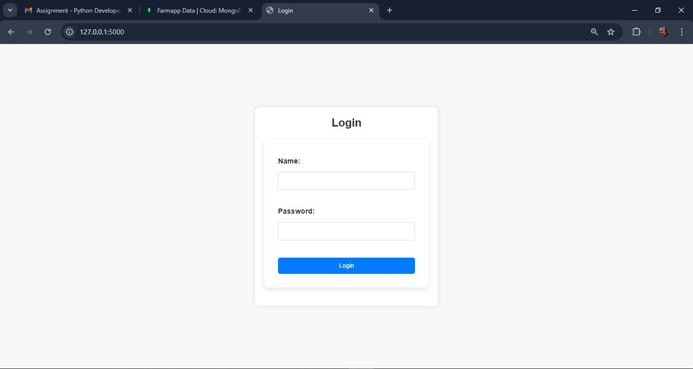
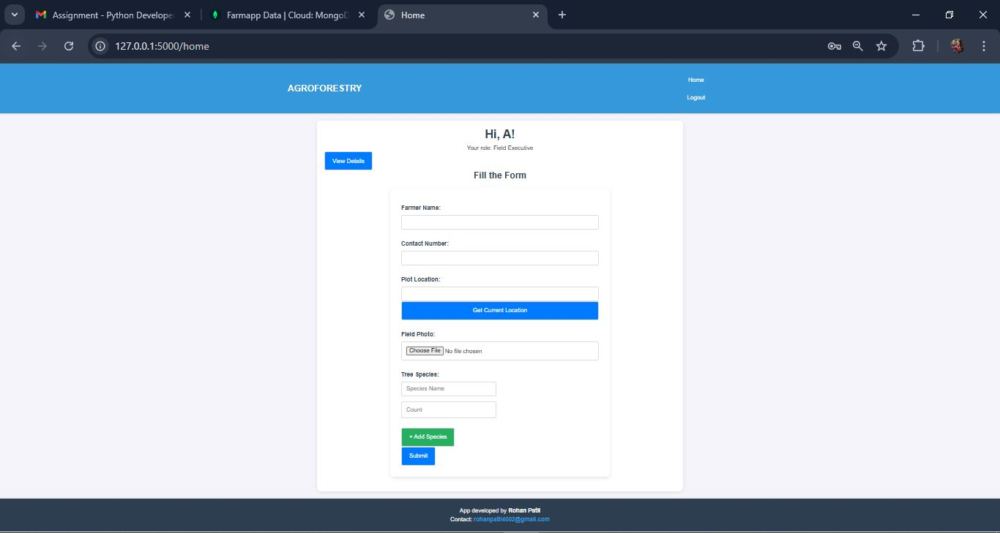

# FarmApp Web Application

## Introduction
My Name is Rohan Patil
   gmail - rohanpatil4002@gmail.com
## Features
1. **Field Executives (A and B):**
   - Each Field Executive can fill in data.
   - Data entered by Executive A is not visible to Executive B and vice versa.

2. **Field Managers (C and D):**
   - Field Manager C oversees Field Executives A and B, allowing them to view all data entered by both A and B.
   - Field Manager D does not have access to data entered by A and B.

3. **Senior Manager (E):**
   - Senior Manager E has access to all data entered by Field Executives and Field Managers.
   - Senior Manager E can update and delete any data.

4. **Role-Based Login System:**
   - Separate login credentials for:
     - Field Executives: `A` (username: A, password: A), `B` (username: B, password: B).
     - Field Managers: `C` (username: C, password: C), `D` (username: D, password: D).
     - Senior Manager: `E` (username: E, password: E).

5. **Dashboard Views:**
   - Field Executives have personalized dashboards.
   - Field Managers have separate dashboards with data visibility based on their access level.
   - Senior Manager has a dashboard for managing and editing all data.

6. **Simple and User-Friendly UI:**
   - The application features a clean and intuitive user interface for ease of use.
   - When filling out data, the system checks to ensure all required fields are completed, minimizing errors and ensuring data integrity.

## Screenshots
1. **Login Page**
   Role-Based Login System:
   - Separate login credentials for:
     - Field Executives: `A` (username: A, password: A), `B` (username: B, password: B).
     - Field Managers: `C` (username: C, password: C), `D` (username: D, password: D).
     - Senior Manager: `E` (username: E, password: E).
   

3. **Home Page**
   

4. **Dashboards:**
   - Field Executive A’s Dashboard: 
   - Field Executive B’s Dashboard: 
   - Field Manager C’s Dashboard: 
   - Field Manager D’s Dashboard: 
   - Field Manager D’s Dashboard: 
   - Senior Manager E’s Edit Dashboard: 

## Installation Instructions

### Step 1: Clone the Repository
```bash
git clone https://github.com/Rohancp29/FarmApp
cd FarmApp
```

### Step 2: Install Dependencies
Ensure you have Python installed on your system. Install the required dependencies using the `requirements.txt` file:
```bash
pip install -r requirements.txt
```

### Step 3: Setup the Database
Run the following command to set up the database:
```bash
python database/db.py
```

### Step 4: Run the Application
Start the application:
```bash
python app.py
```

### Step 5: Access the Application
Open your web browser and navigate to:
```
http://127.0.0.1:5000/
```


